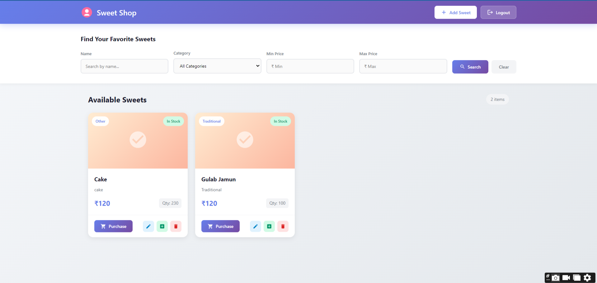
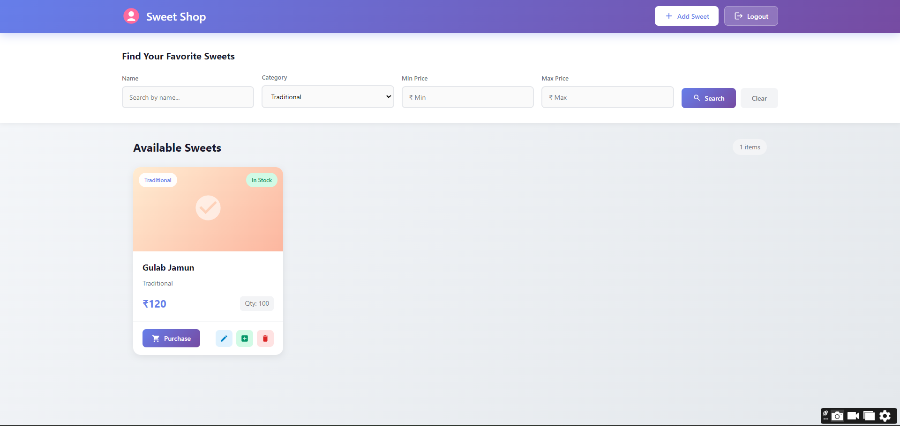
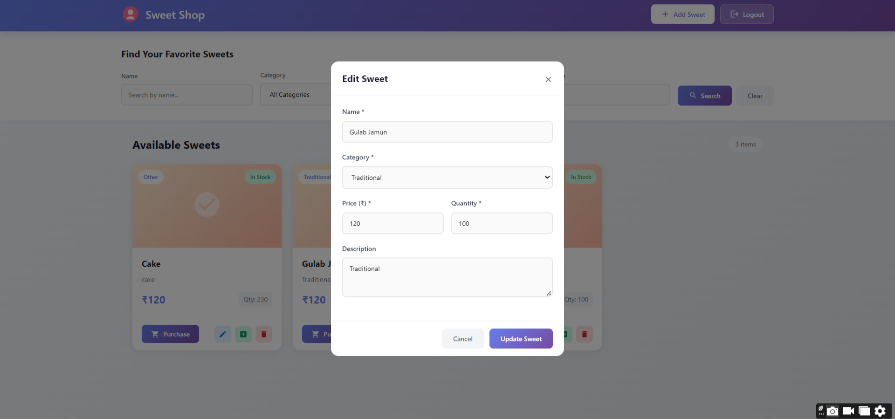
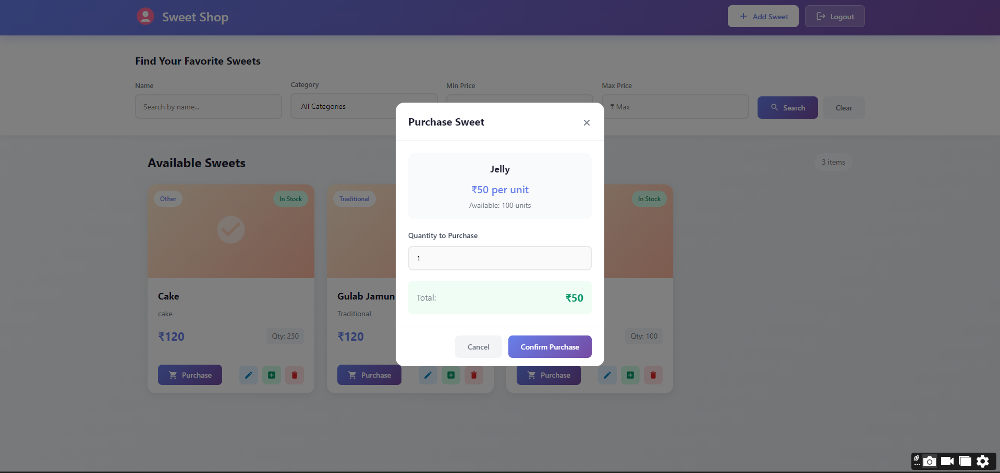
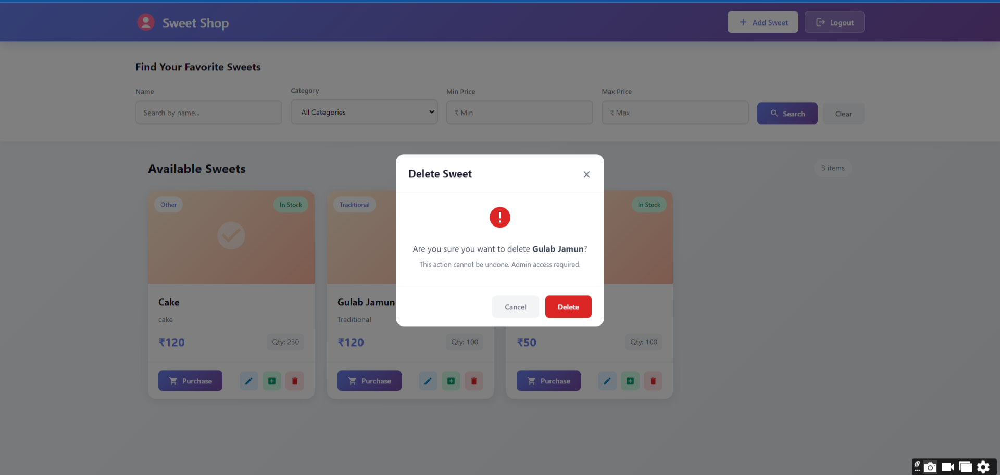

# Sweet Shop Management System 🍬

A modern, full-stack **Sweet Shop Management System** that enables users to browse, search, and purchase sweets while providing administrators with comprehensive inventory management capabilities. Built with Angular 19 for a dynamic frontend experience and Spring Boot 4.0 for a robust, secure backend with JWT-based authentication.

## 📋 Table of Contents

- [Project Overview](#project-overview)
- [Features](#features)
- [Tech Stack](#tech-stack)
- [Setup Instructions](#setup-instructions)
  - [Prerequisites](#prerequisites)
  - [Backend Setup](#backend-setup)
  - [Frontend Setup](#frontend-setup)
- [Screenshots](#screenshots)
- [My AI Usage](#my-ai-usage)

---

## 🎯 Project Overview

The Sweet Shop Management System is a comprehensive web application designed to digitize and streamline sweet shop operations. The system provides:

- **Customer-facing features**: Browse sweet catalog, search and filter products, view details, and make purchases
- **Admin capabilities**: Add, update, delete sweets, manage inventory, and restock products
- **Secure authentication**: JWT-based authentication system with role-based access control (User/Admin)
- **Real-time inventory**: Automatic quantity updates upon purchases with low-stock management

The application follows modern software architecture principles with a clear separation between frontend and backend, RESTful API design, and secure data handling practices.

---

## ✨ Features

### User Features
- 🔐 **User Authentication**: Secure signup and login with JWT tokens
- 🍭 **Browse Sweets**: View all available sweets with details (name, category, price, quantity)
- 🔍 **Search & Filter**: Search sweets by name, category, or price range
- 🛒 **Purchase System**: Buy sweets with automatic inventory updates
- 📱 **Responsive Design**: Modern, mobile-friendly interface

### Admin Features
- ➕ **Add Sweets**: Create new sweet products with details
- ✏️ **Update Products**: Modify existing sweet information
- 🗑️ **Delete Sweets**: Remove products from inventory
- 📦 **Restock Management**: Replenish inventory quantities
- 👥 **User Management**: Role-based access control

### Technical Features
- 🔒 **JWT Authentication**: Secure token-based authentication
- 🛡️ **Spring Security**: Protected endpoints with role-based authorization
- 💾 **PostgreSQL Database**: Persistent data storage with JPA/Hibernate
- 🌐 **CORS Configuration**: Proper cross-origin resource sharing setup
- ⚡ **RESTful API**: Well-structured API endpoints following REST principles

---

## 🛠 Tech Stack

### Frontend
- **Angular 19.2.0** - Modern web framework
- **TypeScript 5.7.2** - Type-safe JavaScript
- **RxJS 7.8.0** - Reactive programming
- **Angular Forms** - Reactive form handling
- **Angular Router** - Client-side routing

### Backend
- **Java 17** - Programming language
- **Spring Boot 4.0.0** - Application framework
- **Spring Security** - Authentication & authorization
- **Spring Data JPA** - Database abstraction with Hibernate
- **PostgreSQL** - Relational database
- **JWT (jjwt 0.13.0)** - JSON Web Token authentication
- **Lombok** - Boilerplate code reduction
- **Maven** - Dependency management

### Development Tools
- **dotenv-java** - Environment variable management
- **H2 Database** - In-memory database for testing
- **JUnit 5** - Unit testing framework

---

## 🚀 Setup Instructions

### Prerequisites

Before running this project, ensure you have the following installed:

- **Java 17** or higher ([Download](https://www.oracle.com/java/technologies/javase/jdk17-archive-downloads.html))
- **Node.js 18+** and **npm** ([Download](https://nodejs.org/))
- **Angular CLI 19+** (install via `npm install -g @angular/cli`)
- **Maven 3.6+** ([Download](https://maven.apache.org/download.cgi))
- **PostgreSQL 12+** ([Download](https://www.postgresql.org/download/))
- **Git** (for cloning the repository)

---

### Backend Setup

#### 1. Clone the Repository

```bash
git clone https://github.com/96Vishesh/Sweet_Shop_MS.git
cd Sweet_Shop_MS/SweetShop-Backend/com.inn.SweetShop
```

#### 2. Configure PostgreSQL Database

**Create the database:**

```sql
CREATE DATABASE sweetshopdb;
```

You can create this database using pgAdmin or the PostgreSQL command line:

```bash
psql -U postgres
CREATE DATABASE sweetshopdb;
\q
```

#### 3. Set Up Environment Variables

Create a `.env` file in the backend root directory (`SweetShop-Backend/com.inn.SweetShop/`):

```bash
cp .env.example .env
```

Edit the `.env` file with your PostgreSQL credentials:

```properties
DB_URL=jdbc:postgresql://localhost:5432/sweetshopdb
DB_USERNAME=postgres
DB_PASSWORD=your_password_here
```

**Important**: Replace `your_password_here` with your actual PostgreSQL password.

#### 4. Build the Backend

Navigate to the backend directory and build the project:

```bash
mvn clean install
```

This will:
- Download all dependencies
- Compile the Java code
- Run tests
- Create the executable JAR file

#### 5. Run the Backend Server

Start the Spring Boot application:

```bash
mvn spring-boot:run
```

The backend server will start on **http://localhost:8080**

You should see output similar to:
```
Started SweetShopApplication in X.XXX seconds
```

**Backend is now running!** ✅

---

### Frontend Setup

#### 1. Navigate to Frontend Directory

```bash
cd ../../SweetShop-Frontend/sweetshop-ui
```

Or if starting from the project root:

```bash
cd SweetShop-Frontend/sweetshop-ui
```

#### 2. Install Dependencies

Install all required npm packages:

```bash
npm install
```

This will install:
- Angular framework and dependencies
- RxJS for reactive programming
- TypeScript compiler
- Development tools and testing frameworks

#### 3. Run the Frontend Application

Start the Angular development server:

```bash
npm start
```

Or alternatively:

```bash
ng serve
```

The frontend application will start on **http://localhost:4200**

You should see output like:
```
✔ Browser application bundle generation complete.
Initial Chunk Files | Names         |  Raw Size
main.js             | main          | XXX.XX kB |

Application bundle generation complete. [X.XXX seconds]
Watch mode enabled. Watching for file changes...
  ➜  Local:   http://localhost:4200/
```

#### 4. Access the Application

Open your web browser and navigate to:

```
http://localhost:4200
```

**Frontend is now running!** ✅

---

### Quick Start Summary

**Backend:**
```bash
# Navigate to backend
cd SweetShop-Backend/com.inn.SweetShop

# Configure .env file with your database credentials
cp .env.example .env

# Build and run
mvn clean install
mvn spring-boot:run
```

**Frontend:**
```bash
# Navigate to frontend
cd SweetShop-Frontend/sweetshop-ui

# Install and run
npm install
npm start
```

**Access:** Open http://localhost:4200 in your browser

---

## 📸 Screenshots

### Application Interface

> **Note**: Add screenshots of your application here. Recommended screenshots:

1. **Login/Signup Page**
   - User authentication interface
   - 
   - 


   
2. **Sweet Catalog/Dashboard**
   - Main page showing all available sweets
   - 


   
3. **Sweet Details**
   - Detailed view of a single sweet product
   
4. **Search & Filter**
   - Demonstration of search and filtering functionality
   - 

   
   
5. **Add/Edit Sweet Form**
   - Form for creating or updating sweet products
   -

   - 

   
6. **Purchase Confirmation**
   - Purchase flow and confirmation
   - 
7. Restock API-
  

8.Delete API-



---

🤖 AI Usage (Limited & Assistive)

AI tools were used sparingly during development, mainly for small, non-critical tasks such as clarifying syntax, fixing minor issues, and validating approaches.
All core logic, architecture, and implementation decisions were designed and written by me.

How AI Helped

Quick clarification of Angular and Spring Boot syntax

Minor help with boilerplate code and configuration

Occasional suggestions for error handling and testing structure

Debugging support for small integration issues

Tools Used

WindSurf – UI scaffolding ideas and minor Angular help

Claude AI – Occasional Spring Boot & JWT clarification

ChatGPT – Small fixes, refactoring suggestions, test guidance

What AI Did Not Do

Did not design the system architecture

Did not write business logic or APIs end-to-end

Did not replace manual coding or testing

Did not make design or security decisions

## 📝 API Endpoints

### Authentication
- `POST /api/user/signup` - Register new user
- `POST /api/user/login` - User login (returns JWT token)

### Sweet Management
- `GET /api/sweets/all` - Get all sweets
- `GET /api/sweets/search` - Search sweets
- `POST /api/sweets/add` - Add new sweet (requires authentication)
- `PUT /api/sweets/update/{id}` - Update sweet (requires authentication)
- `DELETE /api/sweets/delete/{id}` - Delete sweet (admin only)
- `POST /api/sweets/purchase/{id}` - Purchase sweet (requires authentication)
- `POST /api/sweets/restock/{id}` - Restock sweet (admin only)

---

## 👤 Author

**Vishesh Srivastava**

- GitHub: [@96Vishesh](https://github.com/96Vishesh)
- Project Repository: [Sweet_Shop_MS](https://github.com/96Vishesh/Sweet_Shop_MS)

---

## 📄 License

This project was developed as part of the **Incubyte TDD Kata** assessment.

---

**Made with ❤️ using Angular, Spring Boot, and AI-assisted development**
